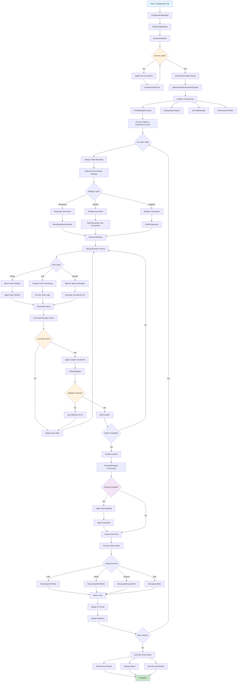

# Faker Rules Catalog and System Analysis

## Table of Contents
1. [Faker Rules Catalog](#faker-rules-catalog)
2. [System Architecture Overview](#system-architecture-overview)
3. [Complete Workflow Diagram](#complete-workflow-diagram)
4. [Step-by-Step Process Flow](#step-by-step-process-flow)

---

## Faker Rules Catalog

### 1. String-Based Simple Rules

These are direct mappings to Faker methods:

```python
# Direct Faker method mappings from data_generator.py
direct_mappings = {
    "bool": lambda: random.choice([True, False]),
    "uuid": lambda: faker.uuid4(),
    "cc": lambda: faker.credit_card_number(),
    "cc_cvv": lambda: faker.credit_card_security_code(),
    "cc_expiry_date": lambda: faker.credit_card_expire(),
    "phone": lambda: faker.phone_number(),
    "phonenumber": lambda: faker.phone_number(),
    "phoneno": lambda: faker.phone_number(),
    "firstname": lambda: faker.first_name(),
    "lastname": lambda: faker.last_name(),
    "timestamp": lambda: faker.date_time().strftime("%Y-%m-%d %H:%M:%S"),
    "name": lambda: faker.name(),
    "email": lambda: faker.email(),
    "address": lambda: faker.address(),
    "city": lambda: faker.city(),
    "text": lambda: faker.text()
}
```

### 2. Dictionary-Based Complex Rules

#### A. Choice Rules
```json
{
    "type": "choice",
    "value": ["ACTIVE", "INACTIVE", "PENDING"],
    "probabilities": {
        "ACTIVE": 0.7,
        "INACTIVE": 0.2,
        "PENDING": 0.1
    }
}
```

#### B. Range Rules
```json
{
    "type": "range",
    "min": 18,
    "max": 80
}
```

#### C. Date Rules
```json
{
    "type": "date_range",
    "start": "2020-01-01",
    "end": "2024-12-31",
    "format": "%Y-%m-%d"
}
```

#### D. Prefix/Suffix Rules
```json
{
    "type": "range",
    "prefix": "CUST-",
    "suffix": "-V1",
    "min": 1000,
    "max": 9999
}
```

#### E. Regex Rules
```json
{
    "type": "regex",
    "regex": "^[A-Z]{2}[0-9]{4}$"
}
```

#### F. Email Rules
```json
{
    "type": "email",
    "regex": ".*@company\\.com$"
}
```

#### G. Phone Rules
```json
{
    "type": "phone_number",
    "country": "US",
    "regex": "^\\+1[0-9]{10}$"
}
```

#### H. Fixed Value Rules
```json
{
    "type": "fixed",
    "value": "DEFAULT_VALUE"
}
```

#### I. OpenAI Generated Rules
```json
{
    "type": "openai_generated",
    "description": "Generate realistic product names for electronics",
    "context_columns": ["category", "brand"],
    "max_length": 100
}
```

### 3. Advanced Rule Features

#### A. Conditional Rules
```json
{
    "conditional_rules": [
        {
            "when": [
                {
                    "column": "age",
                    "operator": ">",
                    "value": 65
                }
            ],
            "then": {
                "rule": {
                    "type": "choice",
                    "value": ["SENIOR", "RETIRED"]
                }
            }
        }
    ]
}
```

#### B. Weighted Choices
```json
{
    "type": "choice",
    "value": ["PREMIUM", "STANDARD", "BASIC"],
    "probabilities": {
        "PREMIUM": 0.2,
        "STANDARD": 0.5,
        "BASIC": 0.3
    }
}
```

#### C. File-Based Choices
```json
{
    "type": "choice_from_file",
    "file_path": "data/cities.csv",
    "column": "city_name",
    "weight_column": "population"
}
```

### 4. Data Type Specific Rules

#### String Types
- `"str"`, `"string"`, `"text"`, `"varchar"`, `"char"`

#### Numeric Types
- `"int"`, `"integer"`, `"float"`, `"double"`, `"decimal"`

#### Boolean Types
- `"bool"`, `"boolean"`

#### Date/Time Types
- `"date"`, `"datetime"`, `"timestamp"`

#### Special Types
- `"uuid"`, `"email"`, `"phone"`, `"url"`

### 5. Constraint Integration

#### Length Constraints
```json
{
    "type": "str",
    "length": 10,
    "rule": {
        "type": "choice",
        "value": ["SHORT", "MEDIUM", "LONG"]
    }
}
```

#### Unique Constraints
```json
{
    "constraints": ["unique"],
    "rule": {
        "type": "sequence",
        "start": 1,
        "step": 1
    }
}
```

#### Primary Key Constraints
```json
{
    "constraints": ["PK"],
    "rule": {
        "type": "uuid"
    }
}
```

---

## System Architecture Overview

The system consists of several interconnected components:

```
┌─────────────────────────────────────────────────────────────────┐
│                    DATA GENERATION SYSTEM                       │
├─────────────────────────────────────────────────────────────────┤
│  Configuration Layer                                            │
│  ├── ConfigurationManager                                       │
│  ├── JSONConfigReader                                           │
│  └── SchemaValidator                                            │
├─────────────────────────────────────────────────────────────────┤
│  Core Generation Layer                                          │
│  ├── DataGenerator (Main)                                       │
│  ├── ValueGenerator (Faker integration)                         │
│  ├── BatchGenerator                                             │
│  └── ParallelDataGenerator                                      │
├─────────────────────────────────────────────────────────────────┤
│  Constraint Management Layer                                    │
│  ├── OptimizedConstraintManager                                 │
│  ├── ForeignKeyManager                                          │
│  └── UniqueConstraintTracker                                    │
├─────────────────────────────────────────────────────────────────┤
│  Validation Layer                                               │
│  ├── UnifiedValidator                                           │
│  ├── DataValidator                                              │
│  └── ValidationPatterns                                         │
├─────────────────────────────────────────────────────────────────┤
│  Output Layer                                                   │
│  ├── StreamingWriters                                           │
│  ├── CSVWriter, JSONWriter, ParquetWriter                       │
│  └── CompressionWriter                                          │
├─────────────────────────────────────────────────────────────────┤
│  Quality & Security Layer                                       │
│  ├── DataQualityAnalyzer                                        │
│  ├── SecurityManager                                            │
│  └── PerformanceProfiler                                        │
└─────────────────────────────────────────────────────────────────┘
```

---

## Complete Workflow Diagram



---

## Step-by-Step Process Flow

### Phase 1: Configuration and Initialization

1. **Configuration Loading**
   ```python
   config_manager = ConfigurationManager()
   config = config_manager.load_configuration("config.json", environment)
   ```

2. **Schema Validation**
   ```python
   json_reader = JSONConfigReader(config_path)
   raw_config = json_reader.load_config()
   validated_config = json_reader.validate_schema(raw_config)
   ```

3. **Auto-corrections Applied**
   - Type conversions (str with numeric rules → int/float)
   - Length constraint optimization
   - Foreign key relationship validation
   - Primary key constraint validation

### Phase 2: Engine Initialization

4. **Component Setup**
   ```python
   engine = OptimizedDataGenerationEngine(config, logger)
   # Initializes:
   # - OptimizedConstraintManager
   # - UnifiedValidator
   # - DataGenerator with sophisticated components
   # - ParallelDataGenerator
   # - DataQualityAnalyzer
   # - SecurityManager
   # - PerformanceProfiler
   ```

### Phase 3: Table Processing

5. **Dependency Resolution**
   ```python
   ordered_tables = process_tables_in_dependency_order()
   # Orders tables based on foreign key relationships
   ```

6. **Strategy Selection**
   ```python
   if total_records > 100000 and enable_streaming:
       strategy = "streaming"
   elif total_records > 10000 and enable_parallel:
       strategy = "parallel"
   else:
       strategy = "adaptive"
   ```

### Phase 4: Data Generation

7. **Value Generation Process**
   ```python
   # For each column in each row:
   value = value_generator.generate_by_rule(rule, data_type, column_name)
   
   # Rule processing hierarchy:
   if isinstance(rule, str):
       return generate_from_string_rule(rule)  # Direct faker methods
   elif isinstance(rule, dict):
       if rule.get("type") == "openai_generated":
           return generate_with_openai_rule(rule, data_type, column_name)
       else:
           return generate_from_dict_rule(rule, data_type)
   ```

8. **Constraint Validation**
   ```python
   # Check unique constraints
   if is_unique_constraint:
       value = constraint_manager.generate_unique_value(table, column, generator)
   
   # Check foreign key constraints
   if is_foreign_key:
       value = fk_manager.get_fk_values_with_relationship(fk_config)
   
   # Apply length constraints
   if length_constraint:
       value = constraint_manager.adjust_value_for_length(value, constraint)
   ```

9. **Validation**
   ```python
   is_valid, message = unified_validator.validate_value(value, rule, data_type)
   if not is_valid:
       regenerate_value()
   ```

### Phase 5: Quality and Security

10. **Quality Analysis** (if enabled)
    ```python
    quality_analysis = data_quality_analyzer.analyze_distribution(batch_data, table_metadata)
    # Checks for:
    # - Data distribution
    # - Anomaly detection
    # - Business rule validation
    # - Statistical compliance
    ```

11. **Security Processing** (if enabled)
    ```python
    # Data masking
    masked_data = security_manager.mask_sensitive_data(data, sensitivity_map)
    
    # Encryption
    encrypted_data = security_manager.encrypt_sensitive_fields(data, sensitive_fields)
    
    # Audit trail
    audit_record = security_manager.audit_data_generation(params, count, columns)
    ```

### Phase 6: Output Generation

12. **Writer Selection**
    ```python
    writer = WriterFactory.create_writer(output_path, format_type)
    # Creates appropriate streaming writer based on format
    ```

13. **Streaming Output**
    ```python
    with writer:
        writer.write_header(columns)
        for batch in batches:
            writer.write_batch(batch)
        writer.write_footer()
    ```

### Phase 7: Reporting and Cleanup

14. **Statistics Collection**
    ```python
    stats = {
        'generation_summary': generation_stats,
        'parallel_generator_performance': parallel_stats,
        'constraint_manager_performance': constraint_stats,
        'performance_profiling': profile_report,
        'quality_metrics': quality_scores,
        'security_metrics': security_operations
    }
    ```

15. **Report Generation**
    ```python
    # Main generation report
    save_enhanced_final_report(stats, output_dir)
    
    # Performance profiling report
    save_performance_profiling_report(output_dir)
    
    # Security audit trail
    save_security_audit_trail(output_dir)
    ```

16. **Resource Cleanup**
    ```python
    engine.cleanup()
    parallel_generator.cleanup()
    constraint_manager.cleanup()
    ```

---

## Key Integration Points

### 1. Faker Integration
- **ValueGenerator** serves as the primary interface to Faker
- Supports both direct method calls and sophisticated rule-based generation
- Integrates with OpenAI for AI-generated content when configured

### 2. Constraint Management
- **OptimizedConstraintManager** handles all constraint logic
- Manages unique values, primary keys, and foreign key relationships
- Provides memory-efficient caching and cleanup

### 3. Validation Pipeline
- **UnifiedValidator** consolidates all validation logic
- Supports complex rules including prefix/suffix validation
- Provides detailed error reporting and batch validation

### 4. Streaming Architecture
- **ParallelDataGenerator** orchestrates the generation process
- Supports multiple strategies: streaming, parallel, and adaptive
- Integrates memory monitoring and performance optimization

### 5. Output Flexibility
- **StreamingWriters** provide format-agnostic output
- Support for CSV, JSON, Parquet, Excel, and SQL formats
- Built-in compression and progress tracking

This comprehensive system provides enterprise-grade synthetic data generation with sophisticated rule processing, constraint management, quality assurance, and security features.